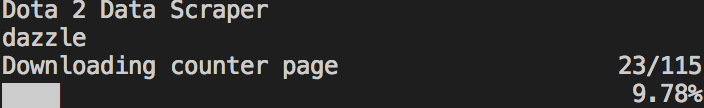
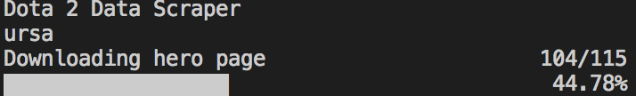

<h1 align="center">
  <br>
  Tugas 1 Seleksi Warga Basdat 2018
  <br>
  <br>
</h1>

<h2 align="center">
  <br>
  Data Scraping
  <br>
  <br>
</h2>

## Description
This program is a data scrapper for the website dotabuff.com. This scrapper auto-save a session into the file state.json. As long as the file is not corrupted, it is possible to continue an interrupted scrapping session.

## Specification

1. Lakukan data scraping dari sebuah laman web untuk memeroleh data atau informasi tertentu __TANPA MENGGUNAKAN API__

2. Daftarkan judul topik yang akan dijadikan bahan data scraping pada spreadsheet berikut: [Topik Data Scraping](http://bit.ly/TopikDataScraping). Usahakan agar tidak ada peserta dengan topik yang sama. Akses edit ke spreadsheet akan ditutup tanggal 10 Mei 2018 pukul 20.00 WIB

3. Dalam mengerjakan tugas 1, calon warga basdat terlebih dahulu melakukan fork project github pada link berikut: https://github.com/wargabasdat/Seleksi-2018/tree/master/Tugas1. Sebelum batas waktu pengumpulan berakhir, calon warga basdat harus sudah melakukan pull request dengan nama ```TUGAS_SELEKSI_1_[NIM]```

4. Pada repository tersebut, calon warga basdat harus mengumpulkan file script dan json hasil data scraping. Repository terdiri dari folder src dan data dimana folder src berisi file script/kode yang __WELL DOCUMENTED dan CLEAN CODE__ sedangkan folder data berisi file json hasil scraper.

5. Peserta juga diminta untuk membuat Makefile sesuai template yang disediakan, sehingga program dengan gampang di-_build_, di-_run_, dan di-_clean_

``` Makefile
all: clean build run

clean: # remove data and binary folder

build: # compile to binary (if you use interpreter, then do not implement it)

run: # run your binary

```

6. Deadline pengumpulan tugas adalah __15 Mei 2018 Pukul 23.59__

7. Tugas 1 akan didemokan oleh masing-masing calon warga basdat

8. Demo tugas mencakup keseluruhan proses data scraping hingga memeroleh data sesuai dengan yang dikumpulkan pada Tugas 1

9. Hasil data scraping ini nantinya akan digunakan sebagai bahan tugas analisis dan visualisasi data

10. Sebagai referensi untuk mengenal data scraping, asisten menyediakan dokumen "Short Guidance To Data Scraping" yang dapat diakses pada link berikut: [Data Scraping Guidance](http://bit.ly/DataScrapingGuidance)

11. Tambahkan juga gitignore pada file atau folder yang tidak perlu di upload, __NB : BINARY TIDAK DIUPLOAD__

12. JSON harus dinormalisasi dan harus di-_preprocessing_
```
Preprocessing contohnya :
- Cleaning
- Parsing
- Transformation
- dan lainnya
```

13. Berikan README yang __WELL DOCUMENTED__ dengan cara __override__ file README.md ini. README harus memuat minimal konten :
```
- Description
- Specification
- How to use
- JSON Structure
- Screenshot program (di-upload pada folder screenshots, di-upload file image nya, dan ditampilkan di dalam README)
- Reference (Library used, etc)
- Author
```

## How to Use
To start a new scrapping session:
~~~
$ cd Tugas1/
$ make
~~~

To continue the last session:
~~~
$ make run
~~~
A session is recorded in the file state.json. To continue a session, make sure the you are running the program from the same directory as state.json.

## Json Structure
Heroes Url List
~~~
[
    {
        "id": "abaddon",
        "name": "Abaddon",
        "url": "https://www.dotabuff.com/heroes/abaddon"
    },
    {
        "id": "alchemist",
        "name": "Alchemist",
        "url": "https://www.dotabuff.com/heroes/alchemist"
    },
]
~~~

Hero Data
~~~
{
    "name": "Abaddon",
    "category": [
        "Melee",
        "Carry",
        "Durable",
        "Support"
    ],
    "popularity": "88th",
    "win-rate": "52.80%",
    "attributes": {
        "primary": "strength",
        "str": {
            "base": 23,
            "growth": 2.6
        },
        "agi": {
            "base": 17,
            "growth": 1.5
        },
        "int": {
            "base": 21,
            "growth": 2.0
        }
    },
    "items": [
        {
            "name": "Phase Boots",
            "matches": 6079906,
            "win-rate": "54.45%"
        },
        {
            "name": "Radiance",
            "matches": 3978566,
            "win-rate": "66.62%"
        }
    ],
    "matchups": [
        {
            "name": "Anti-Mage",
            "disadvantages": "3.92%",
            "win-rate": "51.44%",
            "matches": 964555
        },
        {
            "name": "Outworld Devourer",
            "disadvantages": "3.43%",
            "win-rate": "50.68%",
            "matches": 550613
        }
    ]
}
~~~

Items Url List
~~~
[
    {
        "id": "power-treads",
        "name": "Power Treads",
        "used": 58173969,
        "use-rate": "30.68%",
        "win-rate": "48.49%",
        "url": "https://www.dotabuff.com/items/power-treads"
    },
    {
        "id": "town-portal-scroll",
        "name": "Town Portal Scroll",
        "used": 55079602,
        "use-rate": "29.04%",
        "win-rate": "43.09%",
        "url": "https://www.dotabuff.com/items/town-portal-scroll"
    }
]
~~~

Item Data
~~~
{
    "name": "Abyssal Blade",
    "price": 6900,
    "stats": [
        "+ 25 Damage",
        "+ 250 Health",
        "+ 7 HP Regeneration",
        "+ 10 Strength"
    ],
    "active": {
        "name": "Overwhelm",
        "description": " Stuns a target enemy unit for 2.0 seconds. Pierces Spell Immunity.Range: 140"
    },
    "passive": {
        "name": "Damage Block",
        "description": " Grants a 50% chance to block 70 damage from incoming attacks on melee heroes, and 35 damage on ranged."
    },
    "cooldown": 35.0,
    "manacost": 75,
    "notes": "The stun is melee range.Does not stack with other bashes.The following heroes cannot trigger Bash on this item: Spirit Breaker, Faceless Void, Slardar, and Troll Warlord.Multiple sources of damage block do not stack.",
    "lore": "The lost blade of the Commander of the Abyss, this edge cuts into an enemy's soul.",
    "used-by": [
        {
            "name": "Anti-Mage",
            "matches": 296026,
            "wins": 211650
        }
    ]
}
~~~

## Screenshots

The program is starting
<div style="border-style:solid;border-width:1px;border-color:#999;padding:5px">

</div>

Scrapping in progress
<div style="border-style:solid;border-width:1px;border-color:#999;padding:5px;margin:5px">

</div>
<div style="border-style:solid;border-width:1px;border-color:#999;padding:5px;margin:5px">

</div>
<div style="border-style:solid;border-width:1px;border-color:#999;padding:5px;margin:5px">

</div>
<div style="border-style:solid;border-width:1px;border-color:#999;padding:5px;margin:5px">

</div>

The program has finished scrapping
<div style="border-style:solid;border-width:1px;border-color:#999;padding:5px">

</div>

## Reference
- [Beautiful Soup 4](https://www.crummy.com/software/BeautifulSoup/bs4/doc/)
- [Curl Command Line Tool](https://curl.haxx.se/)

## Author

Suhendi <br>
13516048 <br>
Teknik Informatika <br>